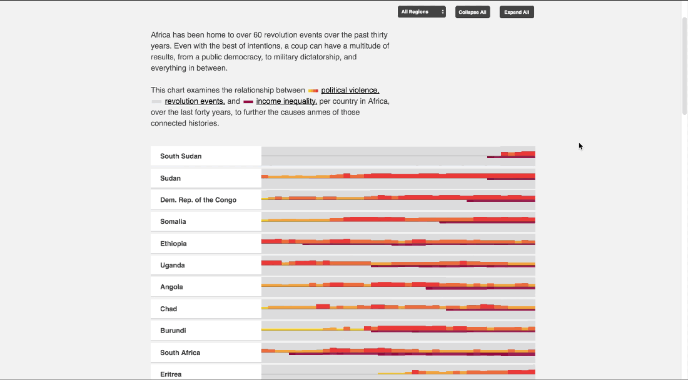
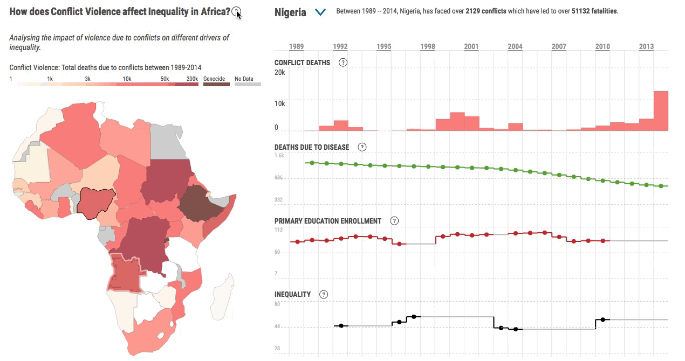
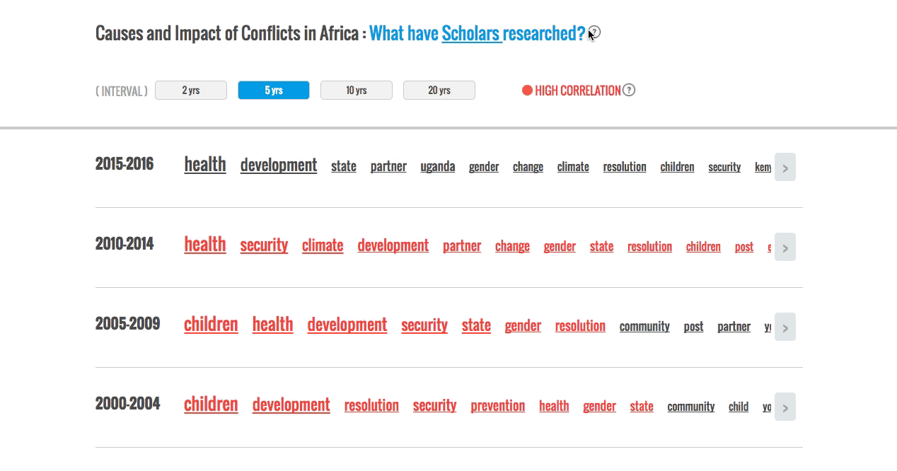
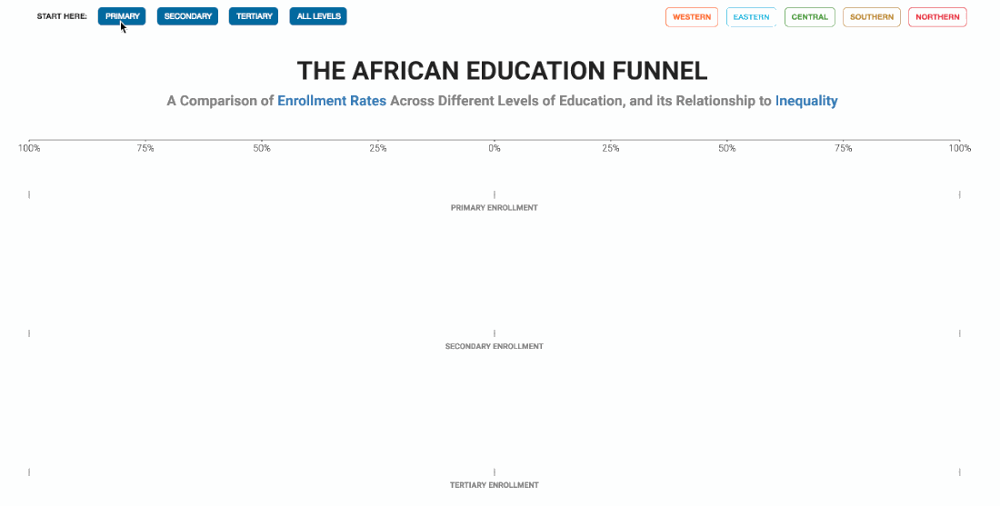
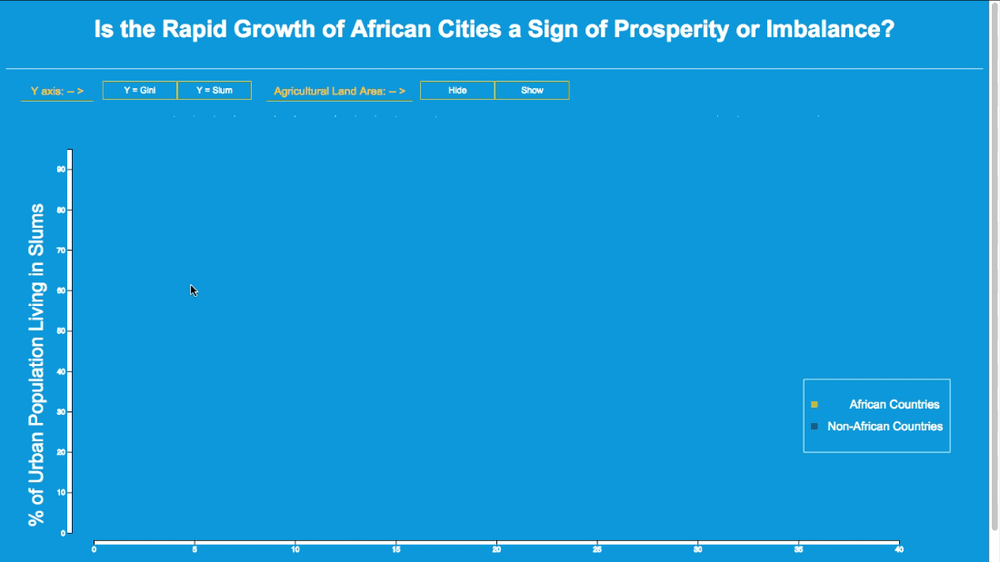
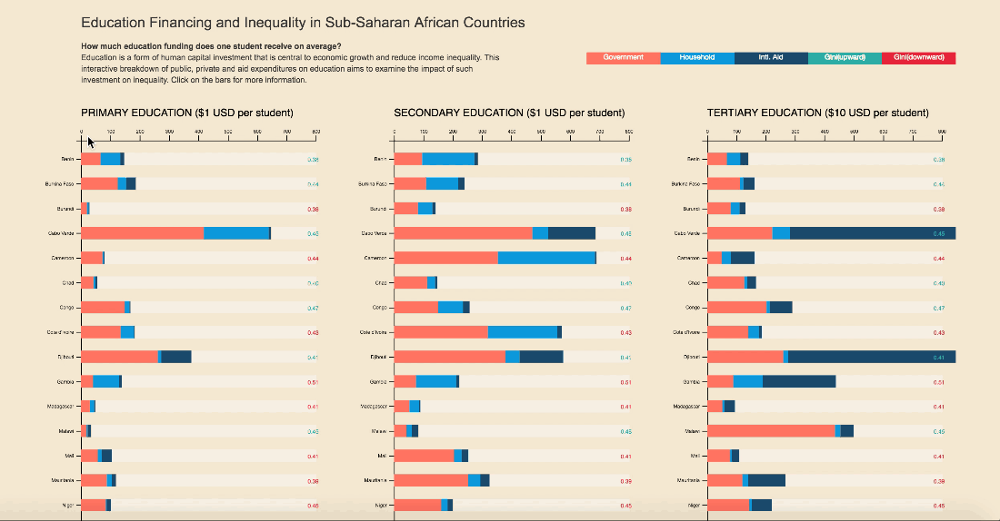
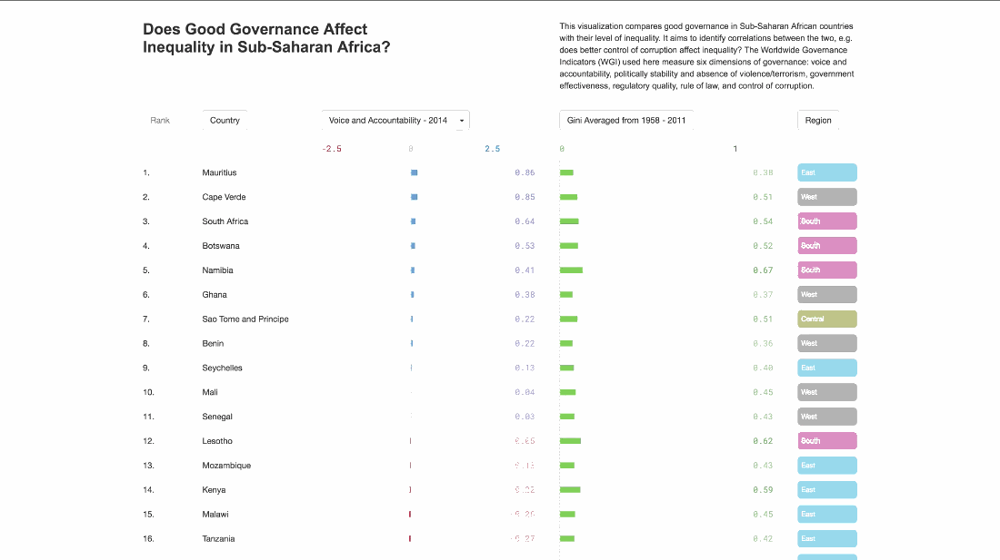
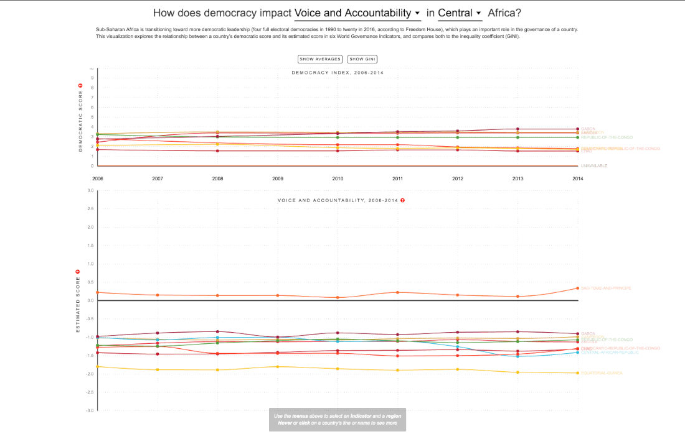

## [Parsons School of Design partners with UNDP Africa](http://www.africa.undp.org/content/rba/en/home/presscenter/articles/2016/11/21/parsons-school-of-design-partners-with-undp-africa-/)

The New York-based school will provide data visualization tools for the Regional Bureau’s upcoming report on economic inequality in Africa

# THE NEW SCHOOL: DATA VISUALIZATION—UNDP RBA Inequality Project Partnership

Partnering with the United Nations Development Programme Regional Bureau for Africa, Parsons Data Visualization students investigate inequality interactions in Sub-Saharan Africa.

#### [RILEY HOONAN](https://github.com/rhoon/major-studio-1/blob/master/README.md)

### The Impact of Violence & Revolution on Inequality in Africa

This chart examines the relationship between political violence, revolution events, and income inequality, per country, over the last forty years, to further examine the causes and outcomes of those connected histories. [[video mp4](media/video/riley-hoonan-major-studio-1.mp4) | [ogg](media/video/riley-hoonan-major-studio-1.ogv)]

#### [ASEEM AGARWAL](https://github.com/agaase/major-studio-1/tree/master/undp)

### How does Conflict affect Inequality in Africa?

Countries in Africa have gone through a number of conflicts since their independence from colonial rule. Violence due to conflicts not only results in deaths and destruction of property, but a greater collateral damage sometimes leading to a complete breakdown of society. With this visualization, we try to understand different drivers of societal inequality due to conflict violence. [[video mp4](media/video/aseem-agarwal-major-studio-1-quantitative.mp4) | [ogg](media/video/aseem-agarwal-major-studio-1-quantitative.ogv)]

### Causes and impacts of conflicts in Africa: What have Scholars researched?

With this project I try to understand what kind of research academic scholars have carried out around conflicts in Africa, specifically related to its impact and cause. For this, I analyze the top 1000 search results from Google Academic Scholar for each year between 1970-2016. Each search result's headline is analyzed to understand its focus, which is ultimately aggregated with all other results to find a larger focus over a time period. [[video mp4](media/video/aseem-agarwal-major-studio-1-qualitative.mp4) | [ogg](media/video/aseem-agarwal-major-studio-1-qualitative.ogv)]

#### [SAMBHAV JAIN](https://github.com/jainsambhav91/major-studio-1/blob/master/README.md)

### The African Education Funnel: A Comparison of Enrollment Rates Across Different Levels of Education, and its Relationship to Inequality

Over the past decade, the primary school enrollment rate in sub-Saharan Africa has significantly improved, now averaging over 80%. However, the poor secondary and tertiary enrollment rates are considerably restricting the region from moving its economy toward higher-productivity sectors. This visualization establishes the gap between the enrollment rates across African countries. [[video mp4](media/video/sambhav-jain-major-studio-1.mp4) | [ogg](media/video/sambhav-jain-major-studio-1.ogv)]

#### [IAN SMITH](https://github.com/Ianssmith/major-studio-1/blob/master/README.md)

### Is the Rapid Growth of Urban African Cities a Sign of Prosperity or Imbalance?

The visualization analyzes the role that infrastructure and agriculture play in making an urban city livable and a place of opportunity. At the most basic level, a city must have food and power to sustain itself; The amount of food imported by a country and the amount of agricultural land is compared to each country’s inequality coefficient (Gini) and the country’s urban population living in a “slum.” [[video mp4](media/video/ian-smith-major-studio-1.mp4) | [ogg](media/video/ian-smith-major-studio-1.ogv)]

#### [NANCY ZHAO](https://github.com/nancyzhao888/major-studio-1/blob/master/README.md)

### Education Financing and Inequality in Sub-Saharan African Countries

Education is a form of human capital investment that is central to economic growth and reduce income inequality. This interactive breakdown of public, private and aid expenditures on education aims to examine the impact of such investment on inequality. [[video mp4](media/video/nan-zhao-major-studio-1.mp4) | [ogg](media/video/nan-zhao-major-studio-1.ogv)]

#### [JOSHUA LEE](https://github.com/neuralism/major-studio-1/blob/master/README.md)

### Does Good Governance Reduce Inequality in Sub-Saharan Africa?

This visualization compares good governance in Sub-Saharan African countries with their level of inequality. It aims to identify correlations between the two, e.g. does better control of corruption affect inequality? The Worldwide Governance Indicators (WGI) used here measure six dimensions of governance: voice and accountability, politically stability and absence of violence/terrorism, government effectiveness, regulatory quality, rule of law, and control of corruption. [[video mp4](media/video/joshua-lee-major-studio-1.mp4) | [ogg](media/video/joshua-lee-major-studio-1.ogv)]

#### [SAM VICKARS](https://github.com/svickars/major-studio-1/blob/master/README.md)

### How is democracy impacted by governance in Sub-Saharan Africa?

Sub-Saharan Africa is transitioning toward more democratic leadership (four full electoral democracies in 1990 to twenty in 2016, according to Freedom House), which plays an important role in the governance of a country. This visualization explores the relationship between a country’s democratic score and its estimated score in six World Governance Indicators — control of corruption, government effectiveness, political stability, regulatory quality, rule of law, and voice and accountability, and compares both to the inequality coefficient (Gini). [[video mp4](media/video/sam-vickars-major-studio-1.mp4) | [ogg](media/video/sam-vickars-major-studio-1.ogv)]

