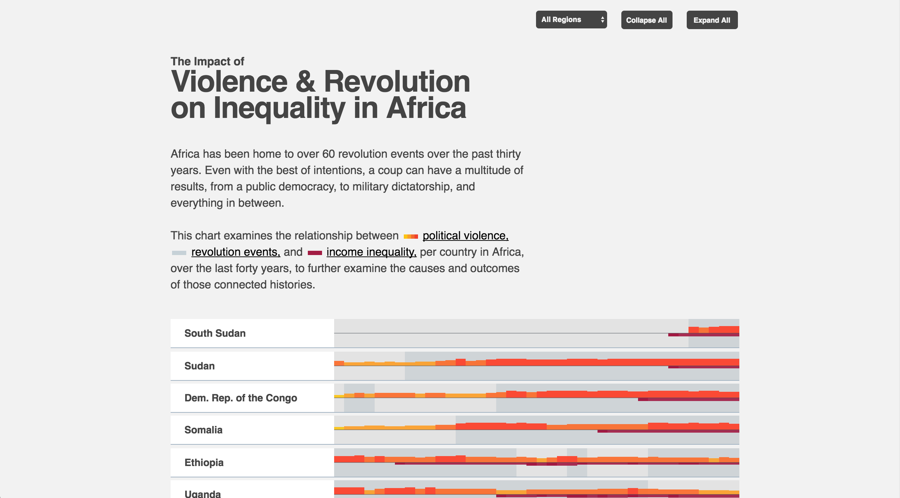
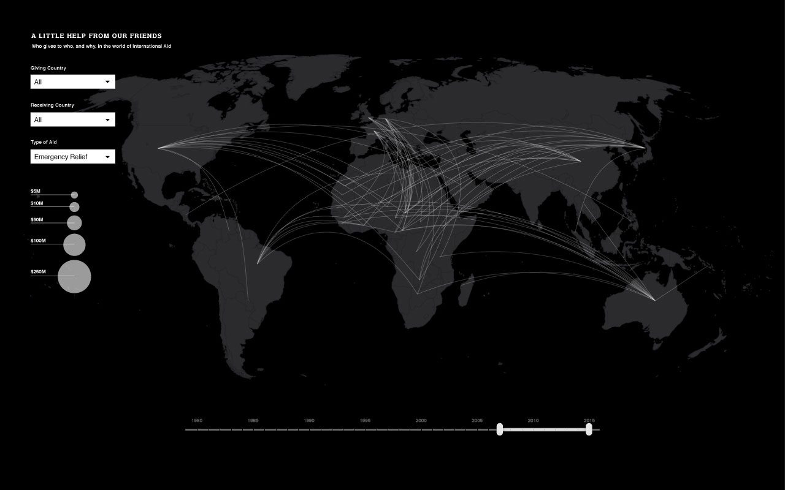
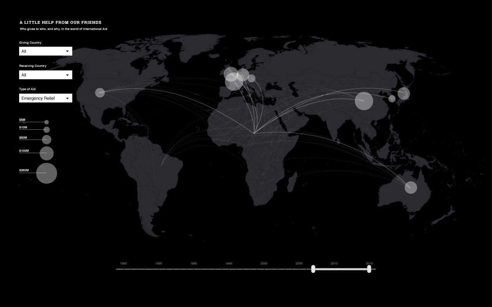

# major-studio-1

##The Impact of Violence & Revolution on Inequality in Africa

This chart examines the relationship between political violence, revolution events, and income inequality, per country, over the last forty years, to further examine the causes and outcomes of those connected histories.

___

>I am studying the relationship between political violence, revolution events and income inequality in Africa because I want to learn more about the causes and outcomes of political violence. I am using a per year average of Political Terror Scale’s 1-5 rating, a timeline of revolution events, and interpolated averages of Gini as my variables. My visualization is based on Political Terror Scale’s database, Center for Systemic Peace’s PITF State Failure Problem Set, and the WIID database (for Gini).

___

## Data Review

–––

###“According to Freedom House, there were only four full electoral democracies in Africa in 1990, which increased to 20 countries by this year.” 
p. 25 Growth, Poverty and Inequality Interactions in Africa: An Overview of Key Issues

###With political upheaval comes political violence and trauma. Comparing this political violence to changes in Gini could reveal interesting stories about the economic byproducts of violence and revolution.

###Primary Source 1:
http://www.politicalterrorscale.org

Political Terror Scale records countries’ compliance with international human rights standards by gathering data from Amnesty International, the US State Dept, and Human Rights watch, and employing a five level coding scheme based on the 1980 Freedom House Yearbook.

###Primary Source 2:
Center for Systemic Peace - broad datasets detailing coup events and other political violence.
Currently associated with George Mason University.
http://www.systemicpeace.org/inscrdata.html

###Primary Source 3:
WIID – World Income Inequality Database
https://www.wider.unu.edu/project/wiid-world-income-inequality-database

###Supplemental Sources:

"Poverty and Equity Database" The World Bank 
http://data.worldbank.org/data-catalog/poverty-and-equity-database

“Coups in the World: 1950 - Present” Jonathan M. Powell  / University Of Central Florida
 http://www.jonathanmpowell.com/coup-detat-dataset.html

___

###Option 2:

A graph showing the flow of aid through the world and it's relationship to Gini data. Rough sketches shown below.

