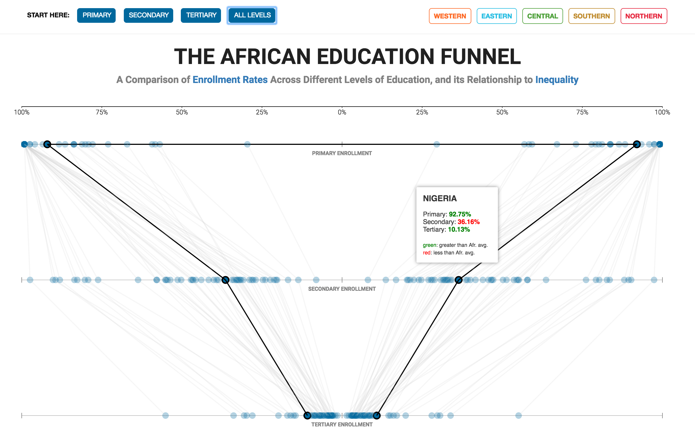

# The African Education Funnel
## A Comparison of Enrollment Rates Across Different Levels of Education, and its Relationship to Inequality

#### Description:

Over the past decade, the primary school enrollment rate 
in sub-Saharan Africa has significantly improved, now averaging over 80%.
However, the poor secondary and tertiary enrollment rates are considerably restricting 
the region from moving its economy toward higher-productivity sectors.
This visualization establishes this gap between enrollment rates across African countries. 

#### Research Question:

> I am studying the state of education enrollment in the sub-saharan african countries because I want to find out how the enrollement rates at different levels of education relate with the inequality levels in these countries. I am considering using the [education enrollments rates](http://data.uis.unesco.org/?queryid=142) and the [GINI coefficient](https://www.wider.unu.edu/project/wiid-world-income-inequality-database) as my variables. My visualization is based on UNESCO Institute of Statistics and the WIID – World Income Inequality Database.

